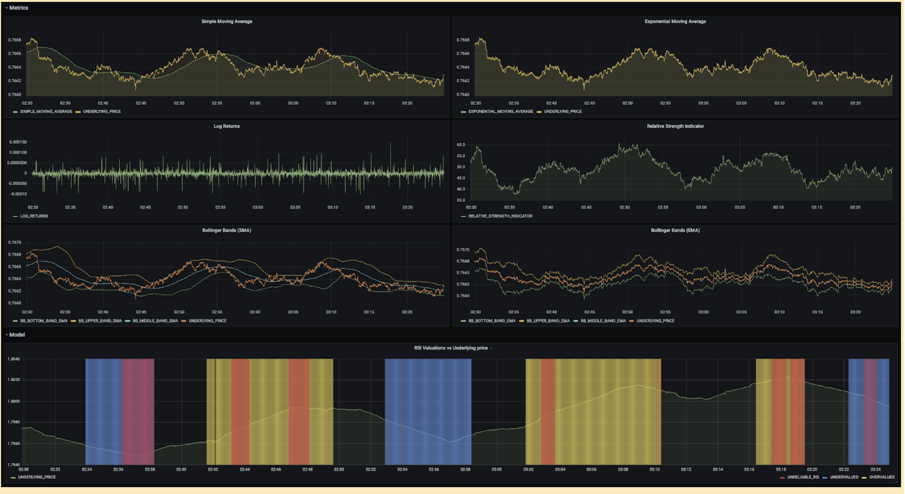
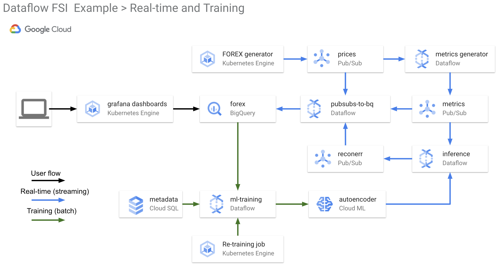

# Dataflow Financial Services Time-Series Example

This project is an example of how to detect anomalies in financial, technical indicators by modeling their expected distribution and thus inform when the Relative Strength Indicator (RSI) is unreliable. RSI is a popular indicator for traders of financial assets, and it can be helpful to understand when it is reliable or not. This is achieved using realistic foreign exchange market data and leverages Google Cloud Platform and the Dataflow time-series sample library. 

The Dataflow samples library is a fast, flexible library for processing time-series data -- particularly for financial market data due to its large volume. Its ability to perform data engineering and generate useful metrics in real-time significantly reduces the time and effort to build machine learning models and solve problems in the finance domain. This library is used in the metrics generator component of this example and detailed information on it's usage can be found in [docs](/docs).

This example uses GCP infrastructure, including Dataflow, Pub/Sub, BigQuery, Kubernetes Engine, and AI Platform. Further information on [components](./docs/COMPONENTS.md), [flows](./docs/FLOWS.md) and [diagrams](./docs/Dataflow-FSI-Example-Real-time.png) can be found in the [docs](./docs/) directory.

## Quickstart

### On a laptop (Mac or Linux or WSL)
To get running quickly,
1. Create a new project in GCP
1. Install `gcloud` and set PROJECT_ID
1. Run the `deploy-infra.sh` to create base infrastructure, this will take 5-10mins
1. Run the `run-app.sh` to deploy the pipelines and model, this will take 5mins
1. View the grafana dashboard

### Run on Cloud Shell
You can also run this example using Cloud Shell. To begin, login to the GCP console and select the “Activate Cloud Shell” icon in the top right of your project dashboard. Then run the following:
1. Clone the repo: `git clone https://github.com/kasna-cloud/tsflow-rsi-example.git && cd tsflow-rsi-example`
1. Run the infrastructure deployment: `./deploy-infra.sh`, this will take 5-10mins
1. Run the pipeline deployment: `./run-app.sh`, this will take 5mins

This repo uses java, python, cloudbuild, terraform and other technologies which require configuration. For this example we have chosen to store all configuration values in the [config.sh](./config.sh) file. You can change any values in this file to modfiy the behaviour or deployment of the example.

## Problem Domain 

The Relative Strength Index, or RSI, is a popular financial technical indicator that measures the magnitude of recent price changes to evaluate whether an asset is currently overbought or oversold.

To detect when RSI is reliable or not for a given asset, the modelling approach is as follows. We train an anomaly detection model to learn the expected behaviour of metrics describing the asset when RSI is greater than 70 or RSI is less than 30. When an anomaly is detected, the model is informing that these input metrics are behaving differently to how they usually behave when RSI is greater than 70 or RSI is less than 30. And so in these instances, RSI is not reliable and a trade is not advised. If no anomaly is detected, then the metrics are behaving as expected, so you can trust RSI and make a trade. _NOTE_

> _This blog contains general advice only. It was prepared without taking into account your objectives, financial situation, or needs. You should speak to a financial planner before making a financial decision, and you should speak to a licensed ML practitioner before making an ML decision._

More information on the problem domain, data science and model creation are in AI Notebooks which you can run yourself, or view. 
* [Example Data Exploration](./notebooks/example_data_exploration.ipynb)
* [Example TFX Model Training](./notebooks/example_tfx_training_pipeline.ipynb)

## Repo Layout

This repo is organised into folders containing logical functions of the example. A brief description of these are below:

### app/bootstrap_models
This is the LSTM TFX model pre-populated with the RSI example so that dashboards can immediately render RSI values. During the `run-app.sh` deployment of components, this model will be uploaded into GCS and a new Cloud Machine Learning model version will be created for the `inference` pipeline to use. This model is then updated by the re-training data pipeline.

### app/grafana
This directory contains visualization configuration used in the grafana dashboards.

### app/java
This holds the Dataflow pipeline code using the Dataflow samples library. This pipeline creates metrics from the prices stream.

### app/kubernetes
This directory has deployment manifests for starting the Dataflow pipelines, prices generator and retraining job.

### app/python
This is a containerized python program for:
    - inference and retraining pipelines
    - pubsub to bigquery pipeline 
    - forex generator to create realistic prices

### docs
This folder contains further example information and diagrams

### infra
Contains the cloudbuild and terraform code to deploy this example GCP infrastructure

### notebooks
This folder has detailed AI Notebooks which step through the RSI use case from a Data Science perspective 

Further information is available in the directory READMEs and the [docs](./docs/) directory.

## Components 

This example can be thought of in two distinct, logical functions. One for real-time ingestion of prices and determination of RSI presence, and another for the re-training of the model to improve prediction.

The logical diagram for the real-time and training in GCP components is below.

### Storage Components
* Three PubSub Topics: prices, metrics, and reconerr
* One BigQuery Dataset with 3 Tables: 
    * prices
    * metrics
    * reconerr
* One AI Platform Model
* One Cloud SQL Database for ML Metadata

### Compute Components
* Autopilot GKE Cluster: 
    * price generator deployment
    * grafana deployment
    * tfx retraining pipeline cron job, and a singleton job to start dataflow streaming pipelines
* Dataflow streaming pipelines:
    * Metrics Library (Java) 
    * Inference Pipeline (Python)
    * 3x PubSub-to-BigQuery Pipelines (Python)
* Dataflow batch pipline:
    * Re-training pipeline created dynamically by TFX when the GKE cronjob is run (every hour)

### Deployment
This example is deployed in two steps:
1. infrastructure into GCP by CloudBuild and terraform
2. application and pipeline deployment using CloudBuild

Both of these CloudBuild steps can be triggered using the `deploy-infra.sh` and `run-app.sh` scripts and require only a [gcloud](https://cloud.google.com/sdk) Google Cloud SDK to be installed locally.

If needed, this example can be run using GCP Cloud Shell. Please refer to the Quickstart section for further information and the README files in the [app](./app/README.md) and [infra](./infra/README.md) directories.

