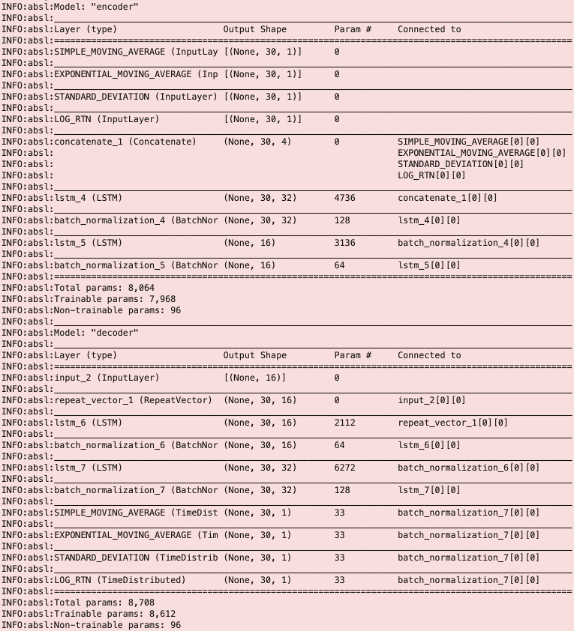
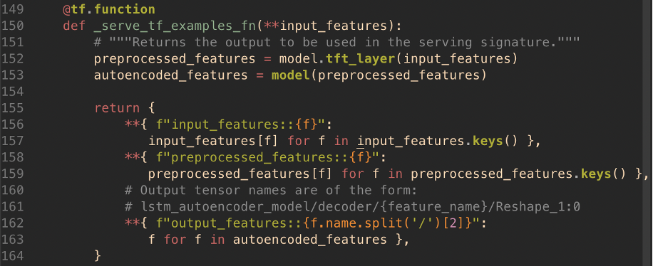

# Detecting Machine Learned Anomalies in Real Time Foreign Exchange Data 

The Relative Strength Index, or RSI, is a popular financial technical indicator that measures the magnitude of recent price changes to evaluate whether an asset is currently overbought or oversold.

The general approach regarding the RSI is to be used as a mean-reversion trading strategy:
* When the RSI for an asset is less than 30, traders should buy this asset as the price is expected to increase in the near future.
* When the RSI for an asset is greater than 70, traders should sell this asset as the price is expected to decrease in the near future.

As a simplified rule, this strategy cannot be trusted to work favorably at all times. Therefore in these instances (i.e. RSI > 70 or RSI less than 30), it would be useful to know if the RSI is a reliable indicator to inform a trade or not.

We propose, for a given asset, that the RSI is a reliable indicator when metrics describing the same asset (e.g. log returns) are behaving as they usually do when RSI > 70 or RSI less than 30. And therefore, the RSI is unreliable to inform a trade when these metrics are behaving anomalously.

To detect when the RSI is reliable or not for a given asset, the modelling approach is as follows. We train an anomaly detection model to learn the expected behaviour of metrics describing the asset when RSI > 70 or RSI less than 30. When an anomaly is detected (and RSI > 70 or RSI less than 30), the model is suggesting informing that these input metrics are behaving differently to how they usually behave when RSI > 70 or RSI less than 30. And so in these instances, the RSI is not reliable and a trade is not advised. If no anomaly is detected, then the metrics are behaving as expected when RSI > 70 or RSI less than 30, so one can trust the RSI signal and make a trade.


The dashboard above illustrates the financial metrics and the model output indicating when RSI is unreliable. One of the key challenges in solving this problem is the data engineering required to produce the financial metrics in real-time. The Dataflow time-series sample library achieves this and is particularly applicable to the finance domain as it is fast and handles large volumes of data well.

This blog post is a deep dive into how to use the Dataflow time-series sample library to build an anomaly detection model that solves this financial markets use case and produce the dashboard above:
1. Synthesizing realistic FOREX prices using Kubernetes Engine
2. Generating financial metrics the Dataflow time-series sample library
3. Designing the anomaly detection model in TensorFlow Keras
4. Training the model in TensorFlow Extended (TFX) using Dataflow, Kubernetes Engine, and AI Platform
5. Hosting the model on AI Platform to serve predictions in real-time that indicate when the RSI is unreliable using Dataflow
6. Creating dashboards to visualize when the RSI is unreliable using Grafana on Kubernetes Engine

Code snippets and paths to files in this blog post refer to this github repository.


The diagram above shows the logical architecture for a real-time and re-training flow using GCP and the Dataflow time-series sample library. We will show how and why to use these components in the solution.

## Synthesizing realistic FOREX prices using Kubernetes Engine

To solve this financial markets problem, we first need some relevant and realistic foreign exchange data. We built a python script for this purpose called the FOREX generator. The FOREX generator produces a new, synthetic price (or tick value) for each of the 17 currency pairs defined in the python class. The default currency pairs and their starting prices are shown below. You can edit these as you see fit in utils.py.


The price changes for each currency pair follow the CKLS (Chan–Karolyi–Longstaff–Sanders) variation of the Ornstein-Uhlenbeck stochastic differential equation, which is a process often applied to model prices of currency pairs. Below you can see the simulated AUDUSD prices produced by the FOREX generator.


To make our price generator more realistic, the duration between consecutive ticks for a currency pair is not constant and is instead sampled from a distribution. You can set the average of this distribution in config.sh by the variable GENERATOR_TICK_HZ, which has a default value of 10 prices per second (per currency pair).

One of the key illustrations in the sample library is the use of Apache Beam model to to fill gaps in the input data, where a gap is a period of nonexistent data. You can see this in the plot below as large gaps exist between consecutive tick values (green plot), whilst the simple moving average (yellow plot, outputted by the sample library) has a data point every second, and reasonable values for each. Note that to fully demonstrate this capability, the simulated CADJPY currency pair shown below is generated at a lower frequency than the other pairs.


We initiate the FOREX generator as an application on Google Cloud Kubernetes Engine, which is a fully managed Kubernetes service. We publish the output to a Pub/Sub topic, which is then consumed by Dataflow time-series sample library. If you would like to explore the prices data, go to example_data_exploration.ipynb.


Generating financial metrics using Dataflow time-series

To solve this use case, we require financial metrics that describe currency pairs, like simple moving average, log returns, and of course relative strength index. As you’re probably aware, generating many metrics like these in real-time, with a large volume of input data, is a difficult task. It is high effort, takes a lot of time, and requires a niche data engineering skill set. The time-series Dataflow samples library manages this for us simply.

We deployed the samples library as a Dataflow job that consumes the output of the FOREX generator. Each data point produced by the library contains a set of metrics per currency pair. The library computes the metrics by processing the input data in sliding windows. You can configure these windows by the following variables in config.sh (their default values are also shown below, units are in seconds).

__METRICS_TYPE_1_WINDOW_SECS = 1__
__METRICS_TYPE_2_WINDOW_SECS = 300__

The first variable (type 1 window length) determines how often a new data point of metrics is generated per currency pair, i.e. 1 new data point per second per currency pair by default. The second variable (type 2 window length) determines the length of the rolling window, i.e. metrics are calculated across 300 second windows by default. It is worth noting that increasing the type 2 window length will increase the memory requirement of the Dataflow job.

The key metrics generated by the Dataflow time-series samples library are listed below. Another feature of the Dataflow sample library is its ability to generate user-defined metrics.
1. Simple Moving Average
1. Exponential Moving Average
1. Standard Deviation
1. Log Returns
1. Relative Strength Indicator
1. Bollinger Bands
1. Min
1. Max
1. Sum

```
SELECT timestamp, symbol, SIMPLE_MOVING_AVERAGE, LOG_RTN, RELATIVE_STRENGTH_INDICATOR
FROM `forex.metrics`
ORDER BY timestamp DESC
LIMIT 17
```


Below is a plot of the Bollinger Bands metric for AUDUSD. This Bollinger Band is based on the simple moving average.


The typical output of the Dataflow sample library is actually windowed metrics in the form tf.Example or tf.SequenceExample. Note that this window refers to the windows inputted to a model with a time dimension, i.e. not the type 1 or type 2 windows mentioned above. The Dataflow sample library computes this in the final stages of its DAG by processing the metrics into windows and then a transformation into tf.Example or tf.SequenceExample. We opted to remove this window processing and transformation to tf.Example from the Dataflow sample library pipeline and instead added them into a custom ExampleGen TFX component. This speaks to the flexibility of the Dataflow sample library. The reasons for this decision are:
1. Allows for easier data understanding and data sanity checks in BigQuery, as data point is at metric level, rather than window level
1. Allows for analysis and model development at metric level, rather than window level
1. Greater flexibility with the model’s window size, as we do not need to redeploy the Dataflow sample library for each model window size we want to test

Unsurprisingly, the Dataflow sample library is deployed into Dataflow, a serverless, fully managed service. The output metrics are published to a Pub/Sub topic, which is then written to BigQuery by our generic pubsubs-to-bigquery Dataflow job. 


Our library metrics are now available both in BigQuery for training the model, and in Pub/Sub for running the model at inference time! If you would like to explore the metrics data, see /notebooks/example_data_exploration.ipynb.

## Designing the anomaly detection model in TensorFlow Keras

With the metrics data in BigQuery, we can now think about how to design a model to detect anomalies for our use case. Given we are using time series data and our objective is to detect anomalies, an LSTM autoencoder is suitable. This kind of model learns the expected distributions of its input features. It is tasked to ‘reconstruct’ the input and when it is incapable of doing so within some margin of error, then the input is outside the expected distributions and is deemed an anomaly.

The use case requires us to detect anomalies in metrics that describe the behaviour of the asset when RSI > 70 or RSI less than 30. Therefore the training data must consist of relevant financial metrics and satisfy this RSI condition. The features selected include the following metrics generated by the Dataflow sample library: simple moving average, exponential moving average, standard deviation, and log returns. The Bollinger Bands are not included in order to avoid multicollinearity, as they are a linear combination of the moving average metrics and standard deviation.

You can specify the currency pair to train the model and run inference for, as well as the number of timesteps in the model input (model window size) with the following variables in config.sh.

__SYMBOL_TO_RUN_LSTM_ON = GBPAUD__
__LSTM_WINDOW_LENGTH = 30__

The architecture of the LSTM autoencoder is outlined below. The model learns the expected distribution of the features by encoding their latent representation in layers lstm_4 and lstm_5, and then decoding in layers lstm_6, and lstm_7. You can see this by the change in the “Output Shape” before and after these layers.



The key pieces of information regarding the model are summarised here:
* 4 input features: Simple Moving Average, Exponential Moving, Average, Standard Deviation, and Log Returns
* 4 outputs, reconstructed by the autoencoder
* 32 outer hidden LSTM units
* 16 inner hidden LSTM units
* Window length (or number of timesteps) is 30

## Training the model in TensorFlow Extended (TFX) using Dataflow, Kubernetes Engine, and AI Platform

Now having designed our anomaly detection model, the next step is to develop a model training pipeline. We used TensorFlow Extended as it works well with TensorFlow models and provides a robust end-to-end pipeline.

The latest 26 hours of data is used for training the model. Of this, the evaluation dataset contains the most recent 2 hours and the 24 hours of data prior is used for the training dataset. As mentioned previously, this data needs to be processed into windows for the model. To do so, we built a custom TFX ExampleGen component that has the following features:
1. Reads data from BigQuery using SQL syntax
1. Windows data according to the input argument window_length, by use of Apache Beam functions
1. Ensures data is sorted in time
1. Ability to drop windows that don’t have the expected size
1. Outputs data in required tf.Example or tf.SequenceExample structure

Below is an example query for reading the training dataset. You will see that we are selecting the Dataflow sample library output metrics that we want as our features.

```
SELECT timestamp, SIMPLE_MOVING_AVERAGE, EXPONENTIAL_MOVING_AVERAGE, STANDARD_DEVIATION, LOG_RTN
FROM `forex.metrics`
WHERE symbol = 'GBPAUD'
   AND (RELATIVE_STRENGTH_INDICATOR > 70 OR RELATIVE_STRENGTH_INDICATOR less than 30)
   AND timestamp BETWEEN TIMESTAMP('2021-05-25 00:00:00') 
 AND TIMESTAMP('2021-05-26 00:00:00')
ORDER BY timestamp
```

Next, the TFX Transform component independently scales each of the model’s features by the z-score function. The TFX Trainer component then trains the model by minimising the loss function: mean squared error between the input features and model output. The model’s evaluation metric is also the mean squared error.

We experimented with different model window sizes to minimise the evaluation metric. You can also experiment with different model window sizes by changing LSTM_WINDOW_LENGTH in config.sh. This value represents how much time we are looking across to detect anomalies. So for example, with a window size of 5 elements and Dataflow sample library parameter METRICS_TYPE_1_WINDOW_SECS = 1, each window represents 5 seconds of metrics. The table below contains the summarised details, you can see that the model achieves the best (lowest) evaluation metric with a window size of 30.

Window Size | Evaluation Metric (MSE) 
--- | ---
 5 | 0.55
 10 | 0.54 
 30 | 0.26
 60 | 0.99 

The final part of the TFX Trainer is defining the model's serving function. In the case of an autoencoder, the TFX model’s serving function needs to output not only the model outputs, but also the scaled input features which were computed by the TFX Transform component. You can see the code below that does this.

 


This is necessary so that at inference time we can determine how different the reconstructed inputs (i.e. model outputs) are to the scaled input features by calculating the squared error between the preprocessed_features and output_features. This is known as the “reconstruction error” which is a metric representing how anomalous the input instance or window is.

An input instance is then deemed an anomaly when the reconstruction error exceeds the model’s threshold. In this example, anomalies were assumed to occur at a rate of 10%, and this corresponds to a model threshold of 72. See /notebooks/example_tfx_training_pipeline.ipynb for details on how we arrived at this model threshold. You can also determine your own anomaly detector’s threshold using the notebook. The model threshold is set at the top of the grafana dashboard UI.

As mentioned previously, the model is tasked to learn the expected distributions of the input Dataflow sample library metrics. And so extreme values in the input should cause the model to fire anomalies. We tested if the model was able to do this on an unseen dataset to the model and the plot below is a visualization of this. You can see the model is able to do this as extreme values (high and low) of the input feature Simple Moving Average (shown in blue) result in anomalies (shown in red with red bars to highlight their position in time).


Now the model training is complete and the TFX Pusher component pushes the model to the serving directory where AI Platform can access it for the inference pipeline.

We execute the TFX training pipeline as a batch Dataflow job which is scheduled 2 hourly via a cronjob on the Kubernetes Engine cluster. We want to re-train regularly to ensure that the model is always aware of the most recent patterns in the financial metrics describing the asset.


The TFX training pipeline requires an orchestrator to execute the sequence of TFX components described above. We have used Apache Beam as the TFX orchestrator. Additionally, TFX requires somewhere to store its metadata. For this we have used MySQL and it is deployed as part of the Kubernetes Engine cluster.

To explore the TFX training pipeline in an interactive setting, see /notebooks/example_tfx_training_pipeline.ipynb.

## Hosting the model on AI Platform to serve predictions in real-time that indicate when the RSI is unreliable using Dataflow

With a trained model served to AI Platform, we now need to create an inference pipeline to get our detected anomalies. Using AI Platform to host the model makes real-time inference a lot easier, as we do not need to develop an API where we can request the model output from.

Using Dataflow, we feed the real-time output of the Dataflow sample library into our trained model on AI Platform and request the model outputs. Note that just like in our training pipeline, we need to process the Dataflow sample library metrics into windows before inputting to the model. To ensure consistency in the data processing across training and inference, the same module that performs these transformations in the TFX ExampleGen training component is used in the inference pipeline. This code is shown below.


As mentioned previously, after obtaining the model output we calculate the reconstruction error between the preprocessed_features and output_features. When the value of the reconstruction error exceeds the model threshold (set on the grafana dashboard), an anomaly has been detected in the Dataflow sample library metrics describing the behaviour of the specified asset. We then deem the RSI is not reliable as these metrics are not behaving as they usually do when RSI > 70 or RSI less than 30.

We start the inference Dataflow pipeline by the “start-dataflow-pipelines” application on the Kubernetes Engine cluster. The DAG for the inference pipeline dataflow job is shown below with the steps outlined in detail also.
1. Read Dataflow sample library metrics to input to the model from Pub/Sub topic “metrics”
1. Deserialize data to JSON
1. Filter for the currency pair specified in config.sh
1. Filter by the RSI condition (RSI > 70 or RSI less than 30), as this is the use case
1. Process elements into a window to construct the model input
1. Input this window to the most recently trained autoencoder model by calling the AI Platform service, which will return the model output
1. Calculate the reconstruction error, which is the squared error between the input metrics (after z-scoring) and output
1. Transform to JSON
1. Serialize from JSON
1. Write {timestamp, currency pair, reconstruction error} to Pub/Sub topic “reconerr”


Finally, the “reconerr” Pub/Sub topic is then written to BigQuery by the generic pubsubs-to-bigquery dataflow job.


## Creating dashboards to visualize when the RSI is unreliable using Grafana on Kubernetes Engine

Users of financial metrics such as traders often visualize them so that it is possible to understand the metrics across time and make decisions based on multiple of them. We have visualized the Dataflow sample library metrics as well as the detected anomalies to inform when the RSI is unreliable. The dashboard is created on Grafana, a tool that is particularly useful for visualizing time series data. You will see the Grafana dashboard open in your web browser upon deployment. 


Both the username and password are your GCP project ID. There are four sections to the dashboard, these are described below.

### Grafana Dashboard - Live Prices of Foreign Exchange
The live price for each of the 17 currency pairs is listed here. This is the output of the FOREX generator and is read from the BigQuery table “forex.prices”.

### Grafana Dashboard - Gap Filling
As mentioned previously, Dataflow sample library is able to fill gaps in input data. You can see this taking place in the plot of price and simple moving average for the CADJPY currency pair.

### Grafana Dashboard - Metrics
Here you will find Dataflow sample library’s metrics visualized for a particular currency pair. To select which currency pair you would like to view, choose the desired currency pair at the top left of the dashboard where a drop down exists for “Currency Pair”. The metrics are read from the BigQuery table “forex.metrics”.

### Grafana Dashboard - Model
This section of the dashboard illustrates the anomalies detected by the model, which are overlaid on the Dataflow sample library metrics (model features) and underlying prices. The first plot shows the underlying price, with sections shaded in yellow for overvalued (RSI > 70), in blue for undervalued (RSI less than 30), and red for detected anomalies. You can therefore interpret when the RSI indicates a buy or sell signal for the currency pair, and when the model detects that the RSI is an unreliable indicator. The anomalies are read from the BigQuery table “forex.reconerr”. If you have built a model for a currency pair, you can view that currency pair’s detected anomalies by selecting it at the top left of the dashboard where a drop down exists for “Model’s Currency Pair”.


## Summary

The Dataflow sample library is a fast, flexible library for processing time series data. It is particularly applicable to use cases that have a large volume of data. Its ability to perform the data engineering and generate useful metrics in real-time significantly reduces the time and effort to build machine learning models and solve problems in the finance domain like detecting when the RSI, or other signals, are unreliable.

## Run this example
This example is available to clone and run in your own GCP environment here.

### On a laptop (Mac or Linux or WSL)
To get running quickly, 
1. Create a new project in GCP
1. Install gcloud and set the PROJECT_ID for you new project.
1. gcloud config set project less thanMY_PROJECT_ID>
1. Run the infrastructure deployment, this will take about 5-10mins.   
`./deploy-infra.sh`
1. Run the pipeline deployment, this will take 5mins.   
`./run-app.sh`
1. View the grafana dashboard

### Run on Cloud Shell
You can also run this example using Cloud Shell. To begin, login to the GCP console and select the “Activate Cloud Shell” icon in the top right of your project dashboard. Then run the following:
1. Clone the repo:   
`git clone https://github.com/kasna-cloud/dataflow-fsi-example.git && cd dataflow-fsi-example`
1. Run the infrastructure deployment, this will take about 5-10mins.   
`./deploy-infra.sh`
1. Run the pipeline deployment, this will take 5mins.   
`./run-app.sh`
1. View the grafana dashboard: login and password are your GCP project ID


