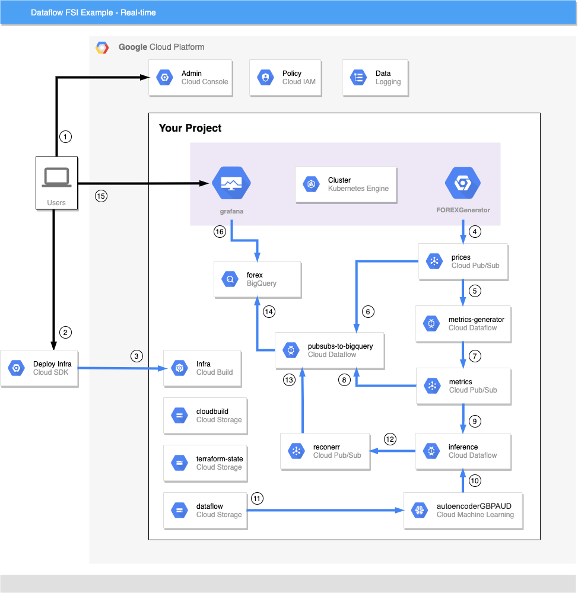
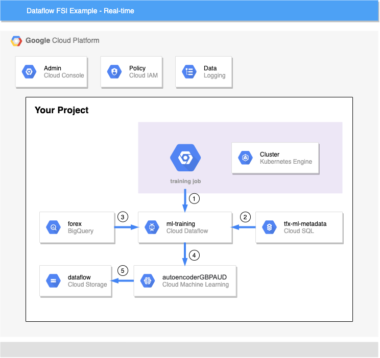

# Dataflow FSI Example flows
This document describes the data flows for this project. There are three primary flows:
1. Infrastructure and application deployment
2. Real-time inference and dashboards
3. Model re-training

## Infrastructure and App Deployment

This example is designed to be run in a fresh GCP project and requires at least `Owner` privileges to the project. All further IAM permissions are set by Cloud Build or Terraform.

The steps for this deployment are:
1. A user logs into the GCP Console and creates a new project. Alternatively, an existing project can be used.
2. The user sets their PROJECT_ID to the new project and executes the `../deploy-infra.sh` and `../run-app.sh` scripts.
3. The script execution performs infrastructure and application build jobs using Cloud Build. These are summarised here: 
    - The deploy infra script will trigger a CloudBuild job which then executes Terraform to build the base infrastructure. Details are available in the [infra readme](../infra/README.md). 
    - After the infra deployment is successful, the user will run the app-run script which sets up the real-time pipelines and training job. More information on this step is available in the [app readme](../app/README.md).

## Real-time 

The real-time price, metrics and inference pipelines will run automatically after deployment and are designed to run continuously to generate better models and dashboard data. The component and data flows for the run time of this example are:

4. Once the infrastructure and app are running, the FOREXGenerator will begin generating prices. This code is [here](../app/python/src/forexgenerator/forexgenerator.py). The FOREXGenerator will produce prices into the `prices` Pub/Sub Topic.
5. The prices stream is read by the `pubsubs-to-bigquery` dataflow job and inserted into BigQuery. [pubsubs-to-bigquery](../app/python/src/pipelines/pubsub_to_bigquery.py)
6. The prices stream is also read by the `metrics-generator` dataflow job where all of the price metrics are generated using the Dataflow time-series samples library. This pipeline is in java and is [here](../app/java/TimeSeriesPipeline/src/main/java/com/google/dataflow/sample/timeseriesflow/)
7. The metrics generator pipeline writes results to the `metrics` Pub/Sub topic.
8. The metrics Pub/Sub stream is read by the `pubsubs-to-bigquery` pipeline and written to BigQuery
9. The `inference` dataflow pipeline reads metrics from the metrics pub/sub subscription and executes the Machine Learning model. [pipeline](../app/python/src/pipelines/inference.py)
10. The inference pipeline will call the Cloud Machine Learning API and `autoencoder` model for prediction.
11. The Cloud Machine Learning API will serve the latest `autoencoder` model from GCS.
12. All Relative Strength Index calculations returned from the model are written to the `reconerr` Pub/Sub topic.
13. The `pubsubs-to-bigquery` dataflow job will pull the reconerr messages and input into BigQuery.
14. The user will login to the Grafana service which is running on the GKE cluster and view the example dashboards.
15. Grafana dashboards will pull prices, metrics and RSI information from BigQuery. 

## Re-Training

On a regular interval, the LTSM TFX model is re-trained and stored in the GCP AI Platform service.

1. A Kubernetes cronjob triggers on the hour to retrain the model, [deployment](../app/kubernetes/training-cronjob.yaml). The dataflow [pipeline](../app/python/src/pipelines/training.py) orchestrates the model re-training.
2. The TFX model metadata must be stored in a reliable storage mechanism and we use CloudSQL for this. A CloudSQL Proxy service runs as a side-car to the cronjob to handle authentication and access by Dataflow to the CloudSQL. 
3. The dataflow pipeline pull stats from the BigQuery and trains the model. [code](../app/python/src/tfx_components/trainer.py)
4. Once completed, the model is written to Cloud Machine Learning service.
5. The Cloud Machine Learning service writes the model to the serving location, GCS.
